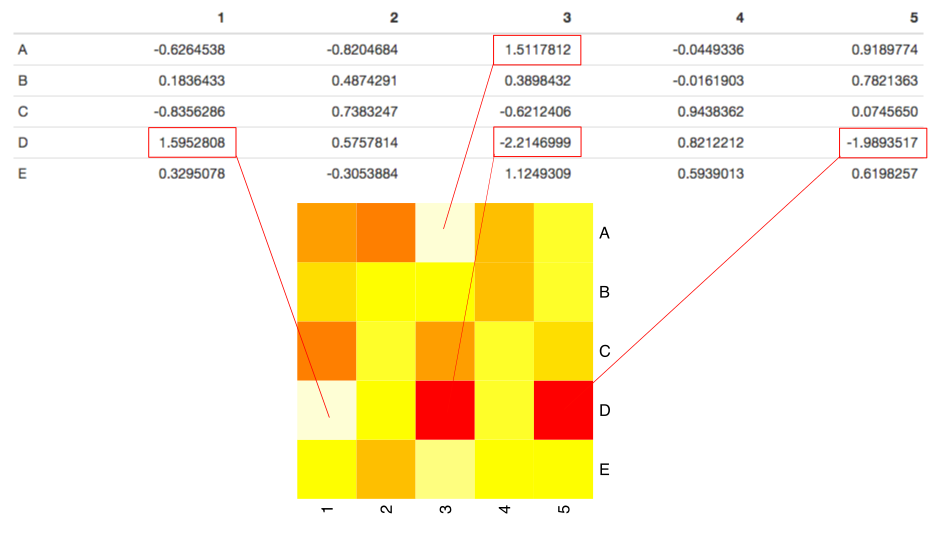

With the amount of data being generated, it is becoming increasingly critical to utilize proper visualization techniques to make sense of such data. One popular visualization technique is a heatmap which aims to to encode individual data values with different colors. By using color encodings of individual values, potential patterns in a dataset can be more readily identified since similar colors would present similar values and dissimilar colors would present dissimilar values. 

The first uses of heatmaps were for 2-dimensional data matrices where the individual data values in each cell were encoded with a different color:

```{r, message = FALSE, echo = FALSE, dev = "svg"}
library("dplyr")
library("knitr")

opts_chunk$set(fig.path = "heatmap-cluster-figs/")
set.seed(1)

mat <- matrix(rnorm(25), 5, 5, 
              dimnames = list(LETTERS[1:5], 1:5))
```



Doing this allowed viewers to immediately spot potential outliers in the data matrix. For example, we can immediately see the red cells in the heatmap which indicate that the cells (D,5) and (D,3) appear to be outliers in the matrix. Referring back to the matrix confirms this as `r mat["D", 5]` (D,5) and `r mat["D", 3]` (D,3) are the most extreme negative values in the matrix. Likewise, the beige cells (A,3) and (D,1) are associated with the most extreme positive values in the matrix. 

It was soon realized that the concept of representing values as colors did not have to be restricted to just data matrices and could be applied in other contexts. For instance, it is common to see [thematic maps](https://en.wikipedia.org/wiki/Thematic_map) which show patterns over some geographical map (image from Wikipedia):


Here the different regions on the map are represented with different colours to indicate how the votes are distributed between the two candidates. Representing such data as colors allows us to see which candidate is doing better in which regions very easily. 

There are several software implementations for generating heatmap with the [R](https://www.r-project.org/) language being one of them. In this post, we will be learning how to generate a heatmap from a data matrix in R. Additionally, we will discuss the importance of scaling and clustering techniques in heatmap generation and how to perform them.

The following R packages need to be installed in order for the code in this post to work:

* [dplyr](https://cran.r-project.org/web/packages/dplyr/index.html)
* [RColorBrewer](https://cran.r-project.org/web/packages/RColorBrewer/index.html)
* [reshape2](https://cran.r-project.org/web/packages/reshape2/index.html)
* [ggplot2](https://cran.r-project.org/web/packages/ggplot2/index.html)
* [d3heatmap](https://cran.r-project.org/web/packages/d3heatmap/index.html)

# Generating a Heatmap from a Data Matrix in R

Let's first generate a 5x5 data matrix and save it as the `mat` variable:

```{r, message = FALSE}
library("dplyr")
library("knitr")

set.seed(1)

mat <- matrix(rnorm(25), 5, 5, 
              dimnames = list(LETTERS[1:5], 1:5))

mat %>%
  as.data.frame %>%
  kable
```

The easiest way to generate a heatmap from this data matrix in R is to use the `image` function:

```{r mat_image}
image(mat)
```

You might notice how the values in the data matrix do not exactly match up with the heatmap Specifically the order of the individual cells appears to be different. As it turns out, the `image` function transposes the data such that the rows become columns and columns become rows. We can fix this by using the `t` (transpose) function on the matrix before using the `image` function

```{r mat_transpose_image}
image(t(mat))
```

This is better now except the order of the rows seems to be different from the input matrix. Specifically, the `image` function actually reverses the ordering of the rows. We can fix this with this piece of code:

```{r mat_reorder_transpose_image}
image(t(mat[nrow(mat):1, ]))
```

All we are doing here is reversing the rows before we pass it into the `image` function. So that when the function reverses it again, it will be in the same order as the input. For those who are interested in knowing why the `image` function behaves like this, please [read this discussion](http://stackoverflow.com/questions/10124180/unexpectedly-transposed-flipped-output-from-r-image-function).

This is almost what we want except we have lost all our x and y labels! There is a way around this where you can manually add the labels, but at this point it's better to just introduce the `heatmap` function. The `heatmap` function is available from base R. We can use it like this:

```{r heatmap}
heatmap(mat[nrow(mat):1, ], Rowv = NA, Colv = NA, scale = "none")
```

This is in fact the same code that I used at the beginning of the post. The `heatmap` function actually calls `t(mat)` to generate the heatmap and thus it will result in the same row re-ordering issue we mentioned already. Hence, why we use the transpose and row re-ordering code again. The benefit of this is that we also get the x- and y-labels added automatically for us.  **You may have noticed additional parameters that I have set (Rowv, Colv, scale). I will explain what these parameters are how to use them in the next section**.

If you want to use a different colour scheme, the `col` parameter allows you to modify this (actually belongs to the `image` function) modify this. By default the colour scheme is set to `heat.colors(12)`:

```{r heatmap_cols}
heat.colors(12)
```

This basically gives us a colour palette that can be correlated to values in the matrix. The `RColorBrewer` R package provides a way to make your colour palette:

```{r heatmap_diff_cols}
library("RColorBrewer")
my.palette <- colorRampPalette(c("green", "black", "red"))(n = 12)
heatmap(mat[nrow(mat):1, ], Rowv = NA, Colv = NA, scale = "none", col = my.palette)
```

Here we are setting a colour gradient such as it goes from green -> black -> red which corresponds to low -> mid -> high values. You can play around this to get the exact colour scheme you want. 

In addition to the base `heatmap` function, there have been a handful of R packages that have improved on the base `heatmap` function (e.g. [gplots - heatmap.2](https://cran.r-project.org/web/packages/gplots/index.html), [heatmap.plus](https://cran.r-project.org/web/packages/heatmap.plus/index.html), [d3heatmap](https://cran.r-project.org/web/packages/d3heatmap/index.html)). The newest one (to the best of my knowledge and at the time of this writing) is d3heatmap from RStudio. This package leverages off [D3](http://d3js.org/) to provide an interactive heatmap:

```{r d3heatmap}
library("d3heatmap")
d3heatmap(mat, Rowv = NA, Colv = NA, colors = heat.colors(12))
```

You can now hover over the cells and see the individual values, zoom in and out. The function also no longer replies on the `image` and thus all the aforementioned issues do not appear when we use the `d3heatmap` function.

# Heatmap Normalization

While heatmaps provide a fantastic way to graphical visualize values, they may not always automatically work right out of the box. I will use an example from the biological sciences to illustrate this. 

Heatmaps are often used in this field to represent "gene expression" matrices. Specifically, the rows represent different biological features (genes) and columns represent different samples. Each cell in the matrix then represents the "expression" of that specific biological feature in a specific sample. Below is an example of one of these matrices and an attempt to generate an heatmap on it. The following matrix is from the scientific paper:

> [Lim, E. L., Trinh, D. L., Scott, D. W., Chu, A., Krzywinski, M., Zhao, Y., et al. (2015). Comprehensive miRNA sequence analysis reveals survival differences in diffuse large B-cell lymphoma patients. Genome Biol, 16, 18](http://doi.org/10.1186/s13059-014-0568-y)

```{r d3heatmap_raw}
mat.file <- "data/mirna-normalized-expression-subset-lim-2015.txt"
mat.lim <- as.matrix(read.table(mat.file, sep = "\t"))

d3heatmap(mat.lim, colors = rev(brewer.pal(9, "RdBu")), Rowv = NA, Colv = NA,
          width = 750, height = 1000, yaxis_width = 180)
```

That looks really funny hey? What is actually happening? We see a strong "striping" pattern occurring across the rows. To gain some insight into the issue, we can take a look at the distribution of the expression values we are working with:

```{r feature_distr, message = FALSE, fig.width = 10}
library("reshape2")
library("ggplot2")

mat.lim %>%
	melt %>%  
	ggplot(aes(x = Var1, y = value)) +
	geom_boxplot() +
	theme(axis.text.x = element_text(angle = 90, vjust = 0.5))
```

The boxplot above shows the distribution of expression values for each feature across the samples. Immediately, certain features are much more highly expressed in all samples compared to other features. And similarly some features are much more lowly expressed than all other features. What's basically happening is that the **between-feature differences** are much greater than the between sample differences. A highly expressed feature will appear a row of all the same colours. For instance, 

```{r feature_highest}
mira.highest <- mat.lim %>%
	melt %>%
	group_by(Var1) %>%
	summarize(mean.vals = mean(value)) %>%
	arrange(desc(mean.vals)) %>%
	slice(1) %>%
	.$Var1 %>%
	as.character
```

The `r mira.highest` is the most highly expressed feature in the dataset. Can you identify which row in the above heatmap it is (red means high expression)?  It should be one of the rows that is basically almost all red. 

So how do we get around this? This is where scaling comes in. What we really want to do is to put every row onto the same scale. Right now the range of each row is a function of the feature's expression level. What we can do is perform what is called Z-score normalization. Specifically:

$$ z = \frac{x - \mu}{\sigma} $$

Where each value in a row, $x$, is subtracted by the row mean, $\mu$, and then divided by the row standard deviation $\sigma$. This effectively converts each value into a z-score and places all rows onto the same scale. The `d3heatmap` function provides the ability to do a z-score row normalization by using the `scale = "row"`:

```{r d3heatmap_row_norm}
d3heatmap(mat.lim, colors = rev(brewer.pal(9, "RdBu")), Rowv = NA, Colv = NA,
          width = 750, height = 1000, yaxis_width = 180, scale = "row")
```

This looks a bit better. We no longer have the "stripe" patterns in the rows anymore. 

# Heatmap Clustering

We've improved things a bit, but now what we see are columns/samples that have similar patterns. It would be interesting to actually group these samples together. This is where the concept of clustering comes in. Clustering is a machine learning technique that aims to "group" together (i.e. cluster) similar things. 

The `d3heatmap` function (and `heatmap`) actually performs the clustering automatically for you for both rows and columns. In the previous section, I had turned it off using `Rowv = NA` and `Colv = NA` to demonstrate only the heatmap component of the function. Let's see what happens if we enable column clustering following row normalization.

```{r d3heatmap_row_norm_cluster}
d3heatmap(mat.lim, scale = "row", Rowv = NA, colors = rev(brewer.pal(9, "RdBu")), 
          width = 750, height = 1000, yaxis_width = 180)
```

This is a nice final output that you often see in biological papers. We can clearly see two "clusters" as indicated by the dendrogram/tree on the top. The samples on the left cluster demonstrates higher expression (red) while the samples in the right cluster exhibit lower expression for these features (blue). In fact, this actually makes perfect sense because the samples on the side of the dendrogram is a completely different set of biological samples from the right. 

# Conclusions

I hope this post has helped you understand what heatmaps are and how to generate them in R. You should also now understand the importance of normalization and clustering of data to produce the final outputs you see in biological science papers and other related fields. This is just the tip of the iceberg though. Some further areas of interest in generating heatmaps may be:

* [Exploring different forms of clustering](http://stackoverflow.com/questions/6806762/setting-distance-matrix-and-clustering-methods-in-heatmap-2)
* [Extracting the dendrograms](http://seqanswers.com/forums/showthread.php?t=32279)
* [Adding annotation tracks for rows and samples](https://www.biostars.org/p/18211/)

## Contact

Feel free to contact me for help regarding this content:

* email: fongchunchan@gmail.com
* twitter: [https://twitter.com/fongchunchan](https://twitter.com/fongchunchan)
* blog: [http://tinyheero.github.io/](http://tinyheero.github.io/)

## R Session

```{r r_session}
sessionInfo()
```
